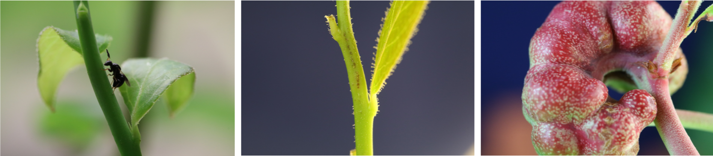

# Insect Gall Effects on Gene Expression and Gene Network Rewiring in Plants:
Herbivorous insects and plants are engaged in a never-ending evolutionary arms race. While plants have evolved a diverse set of defenses to combat predation, insects have in turn developed a diverse set of counter-adaptations to overcome these defenses. Some highly-specialized herbivorous insects, called endophytophygous insects (living inside their host) possess elegant mechanisms to maniuplate the physiology of their host plant. Galling insects are once such example. Galling insects redirect plant chemical pathways to induce the formation of a tumor-like organ, a gall, on the host to live, feed, and reproduce while being protected from predators and the environment. 

Previously, research by my PI, [Patrick Edger](https://polyploidy.msu.edu/patrick_edger/index.html), has uncovered that *Daktulosphaira vitifoliae* (grape phylloxera) hijack floral development pathways to form galls on grape leaves[^1]. However the underlying mechanism of gall induction in general still remains poorly understood.

Recently, as part of a collaborative project between the [Edger Lab](https://polyploidy.msu.edu/index.html) and the [Appel-Schultz lab](https://schultzappel.wordpress.com/) I performed a number of data analysis techniques to identify and quantify gene expression differences in grapes under multiple different chemical treatments and time points. Under that project I learned how to take raw RNA-seq data, align it to the appropriate genome, accurately quantify it, and perform differential gene expression analysis.

Currently, I am working on a similar project involving *Vaccinium corymbosum* (Highbush blueberry) and the *Hemadas nubilipennis* (blueberry stem gall wasp). Scientifically, blueberry is a great system to study the effects of wasp-gall reprogramming due to the availability of genomic resources for both the highly susceptible and resistant genotypes.

Here my work draws on the skills I developed while working on the grape project. While I am still generating gene expression tables from raw RNA-seq data and evaluating differentially expressed genes, my work now goes several steps beyond that. I am working to leverage gene co-expression network analysis techniques with the differentially expressed gene set to identify key genes involved in the galling response and pinpoint the metabolite pathways involved.

# Phenotypic and Metabolic Diversity Shaped by Transposable Elements in Strawberry:
Check back for more soon!

# Footnotes:
[^1]:[A galling insect activates plant reproductive programs during gall development](https://www.nature.com/articles/s41598-018-38475-6)
